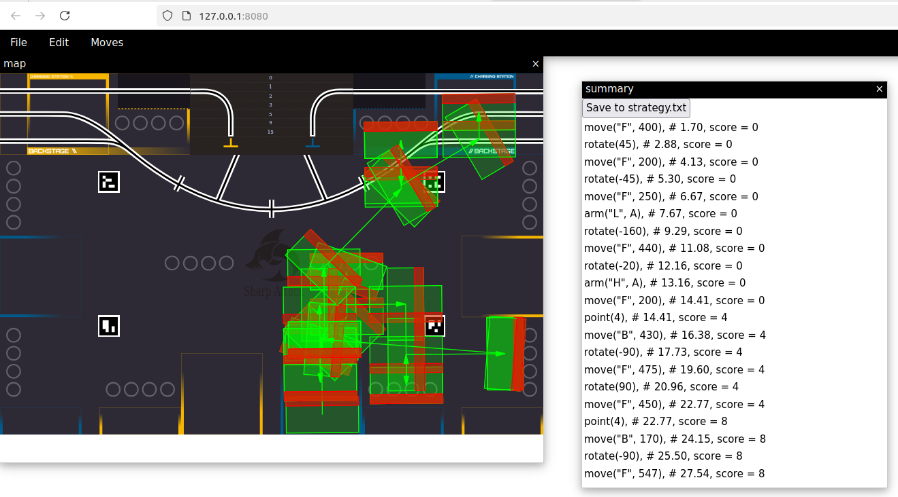

# Sleepsaver 2, the strategy editor that saves your sleep AND your sanity

# General Commands

Applications keybindings all start by <kbd>Meta</kbd> (or <kbd>Alt</kbd>).

| Command                 | Key            |
|-------------------------|----------------|
| Swap moves              | <kbd>M-s</kbd> |
| Put move after          | <kbd>M-f</kbd> |
| Edit any move           | <kbd>M-!</kbd> |
| Delete move             | <kbd>M-d</kbd> |
| Clear moves             | <kbd>M-k</kbd> |
| Copy text output        | <kbd>M-w</kbd> |
| Copy action text output | <kbd>M-z</kbd> |
| New action              | <kbd>M-a</kbd> |
| Edit action             | <kbd>M-e</kbd> |
| Delete action           | <kbd>M-q</kbd> |

# Existing Configurations

Configurations define their *own* commands and keybindings, that start by <kbd>Control</kbd>.

## 2023

## 2024

| Command                | Key              |
|------------------------|------------------|
| Rotate precisely       | <kbd>C-M-r</kbd> |
| Translate precisely    | <kbd>C-M-t</kbd> |
| Translate visually     | <kbd>C-t</kbd>   |
| Take plant             | <kbd>C-!</kbd>   |
| Place ground plant     | <kbd>C-@</kbd>   |
| Place garden plant     | <kbd>C-^</kbd>   |
| Pass claw content up   | <kbd>C-u</kbd>   |
| Pass claw content down | <kbd>C-d</kbd>   |
| Open top claws         | <kbd>C-o</kbd>   |

## 2024-ceri

| Command    | Key            |
|------------|----------------|
| F(orward)  | <kbd>C-f</kbd> |
| B(ackward) | <kbd>C-b</kbd> |
| U(p)       | <kbd>C-u</kbd> |
| R(otate)   | <kbd>C-r</kbd> |
| O(pen)     | <kbd>C-o</kbd> |
| C(lose)    | <kbd>C-c</kbd> |

## 2025-ceri

| Command    | Key            |
|------------|----------------|
| F(orward)  | <kbd>C-f</kbd> |
| B(ackward) | <kbd>C-b</kbd> |
| U(p)       | <kbd>C-u</kbd> |
| D(own)     | <kbd>C-d</kbd> |
| R(otate)   | <kbd>C-r</kbd> |
| H(igh)     | <kbd>C-h</kbd> |
| L(ow)      | <kbd>C-l</kbd> |

Replace `Copy` button in Summary window by `Save in Strategy.txt button`.

That save the current strategy in a file for direct use in the run python program.

# How to build an executable

You need the following dependencies:

- `sbcl`
- `quicklisp`

Simply run `make` !
